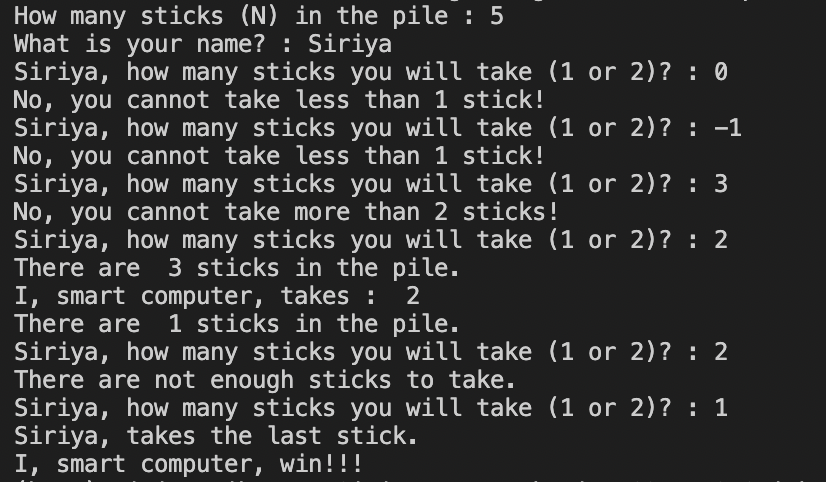

# DS270702-SticksInThePipe
## _The Pipe Game is the game that allows you to play with Python._
The Rule : The player that takes the last stick will lose.
- You play as the Player1
- Python plays as the Player2

## _Game Start!_
### To start the game, you have to input more than one stick.

## _The result of the program_
### a) In case of you win! : 
- The program will show the result as below.

### b) In case of Python wins! : 
- The program will show the result as below.

### c) In case of ERROR : 
- The program will show the result as below.

